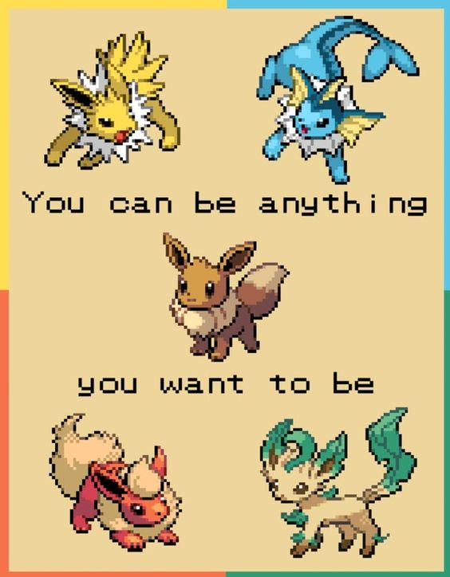

Welcome!!!

I will help you understand more about Python. I thought I was going to make it fun so I decided to add pokemons to the lesson so even if you are suffering trying to understand trees. At least, there is something cute to stare at. I hope this tutorial is clear and helpful, I tried to add as much important information and links that have been helpful.

I know you guys will do awesome!

Good Luck!

This is my email if anyone needs to contact me or ask for help.

nol18003@byui.edu