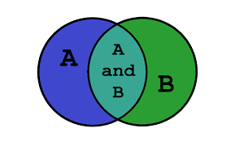

## Sets

Sets are used to store multiple items in a single variable.

# Sets characteristics 

- Set is one of 4 built-in data types in Python used to store collections of data, the other 3 are List, Tuple, and Dictionary, all with different qualities and usage.

- A set is a collection which is both unordered and unindexed.

- Sets are written with curly brackets.

`thisset = {"Charizard", "Vulpix", "Entei"}`

`print(thisset)`
 
Now we have created a set of fire type pokemons!!!

# Facts about Sets 

- Unordered means that the items in the set don't have a specify order
- Unchangeabke means that we cannot change the order after the set has been created. 
- Duplicates are not allowed. Sets cannot have two indentical values.

`thisset = {"Charizard", "Vulpix", "Entei", "Vulpix"}`

`print(thisset)`

The output will delete the duplicate it item.

# Hashing and Sets

Set in Python can be defined as the collection of items. In Python, these are basically used to include membership testing and eliminating duplicate entries. The data structure used in this is Hashing, a popular technique to perform insertion, deletion and traversal in O(1) on average. The operations on Hash Table are some what similar to Linked List. Sets in python are unordered list with duplicate elements removed.

[More info](https://realpython.com/python-sets/)

## Practice

- [Practice 1](https://replit.com/@TammyNolasco/Setpractice)

[Solution](https://replit.com/@TammyNolasco/SetPracticesolution)

- [Practice 2](https://replit.com/@TammyNolasco/SetsolutionMxandMin)

[Solution](https://replit.com/@TammyNolasco/SetSolution2)