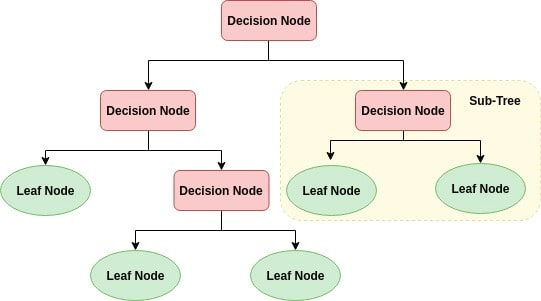

## Trees

A tree whose elements have at most 2 children is called a binary tree. Since each element in a 
binary tree can have only 2 children, we typically name them the left and right child.

# Binary tree node contains:
- Data
- Pointer to the left child
- Pointer to the right child

## Important Vocabulary

- Node – The most elementary unit of a binary tree.

- Root – The root of a binary is the topmost element. There is only one root in a binary tree.

- Leaf – The leaves of a binary tree are the nodes which have no children.

- Level – The level is the generation of the respective node. The root has level 0, the children of the root node is at level 1, the grandchildren of the root node is at level 2 and so on.

 - Parent – The parent of a node is the node that is one level upward of the node.

- Child – The children of a node are the nodes that are one level downward of the node.

## Code Examples

`# The Node Class defines the structure of a Node`
`class Node:`
   
`# Initialize the attributes of Node
    def __init__(self, data):`
`

       `self.left = None # Left Child
        self.right = None # Right Child
        self.data = data # Node Data `

## Initialize binary tree

`class Node:`

    def __init__(self, data):

        self.left = None
        self.right = None
        self.data = data

`root = Node(10) # Instantiating the Tree`

`# Tree Structure`

`#        10`

`#      /    \`

`#     None   None`

`root.left = Node(34) # Setting the left child of the root to 34`

`root.right = Node(89) # Setting the right child of the root to 89`

`# Tree Structure`

`#          10`

`#        /    \`

`#       34      89`

`#     /    \  /    \`

`#  None  None None None`

## Tree traversal 

Any time you see a new data structure, your first question should be, How do I traverse it? The most natural way to traverse a tree is recursively. For example, if the tree contains integers as cargo, this function returns their sum:

`def total(tree):`

    `if tree == None: return 0
    return total(tree.left) + total(tree.right) + tree.cargo`

The base case is the empty tree, which contains no cargo, so the sum is 0. The recursive step makes two recursive calls to find the sum of the child trees. When the recursive calls complete, we add the cargo of the parent and return the total.

[More Info](https://www.educative.io/edpresso/binary-trees-in-python)

[Really helpful link](https://medium.com/swlh/making-data-trees-in-python-3a3ceb050cfd)

[Practice](https://replit.com/@TammyNolasco/Treespractice)

[Solution](https://replit.com/@TammyNolasco/treessolution)
